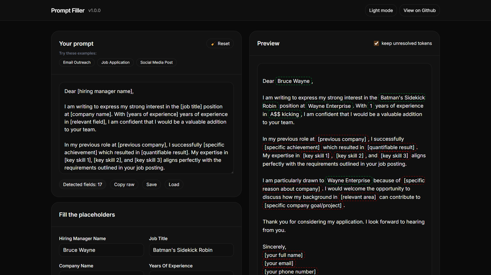

# Prompt Filler

Prompt Filler is a modern tool to manage and fill dynamic AI prompts with placeholders. Built with **Tailwind CSS v4** and **Alpine.js**, it detects placeholders like `[your name]`, `[email]`, `[company]` in your prompt, generates input fields automatically, and shows a live preview with smart highlighting.

## Features

- **Dynamic Placeholder Detection** – Auto-detects all placeholders in your prompts across multiple formats.
- **Smart Label Formatting** – Automatically converts `[sender_name]`, `[sender-name]`, or `[senderName]` into clean labels like "Sender Name".
- **Interactive Input Fields** – Quickly fill values for each placeholder with keyboard shortcuts (Enter to move to next field).
- **Live Preview with Click-to-Edit** – Click any placeholder token in the preview to jump to its input field. Filled tokens show in green, unfilled in red with pulsing animation.
- **Demo Prompts** – Try example prompts via clickable pills.
- **Dark Mode** – Toggle between light and dark themes.
- **Multiple Export Options** – Copy raw or filled prompts, download as JSON, or use the quick-copy button.
- **Local Storage Persistence** – Your prompts and values are automatically saved in your browser.
- **Keyboard Shortcuts** – Ctrl/Cmd+S (save), Ctrl/Cmd+Shift+C (copy raw), Ctrl/Cmd+Shift+V (copy filled), Ctrl/Cmd+Shift+X (clear values).

## How it works

- Paste or type a prompt with placeholders using one of the supported formats (you can enable/disable formats in the UI):
  - `[placeholder]` (square brackets) - **enabled by default**
  - `{{placeholder}}` (Handlebars style)
  - `${placeholder}` (template literal style)
  - `{placeholder}` (simple braces)
  - Custom delimiters — enter an opening and closing delimiter (e.g. `<<` and `>>`) to detect `<<placeholder>>`.
- The app detects unique placeholders across mixed formats and automatically cleans up labels:
  - `[sender_name]` → "Sender Name"
  - `[sender-name]` → "Sender Name"  
  - `[senderName]` → "Sender Name"
  - `[company.email]` → "Company Email"
- Input fields are generated for each unique placeholder. Fill in your values, or click "Fill example" for demo data.
- The preview updates in real time and highlights filled/unfilled tokens. Click any token to jump to its input field.
- Use keyboard shortcuts to navigate: press Enter to move to the next field, or use Ctrl/Cmd+S to save.
- Copy the final text, export values as JSON, or toggle the option to show/hide unfilled placeholders in output.
